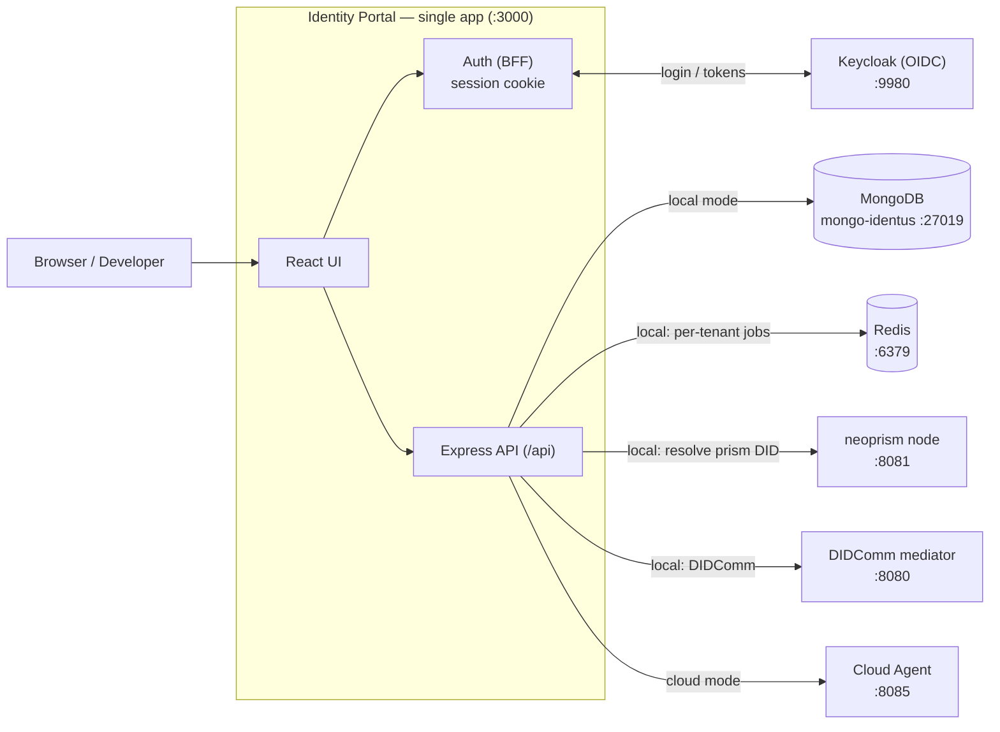
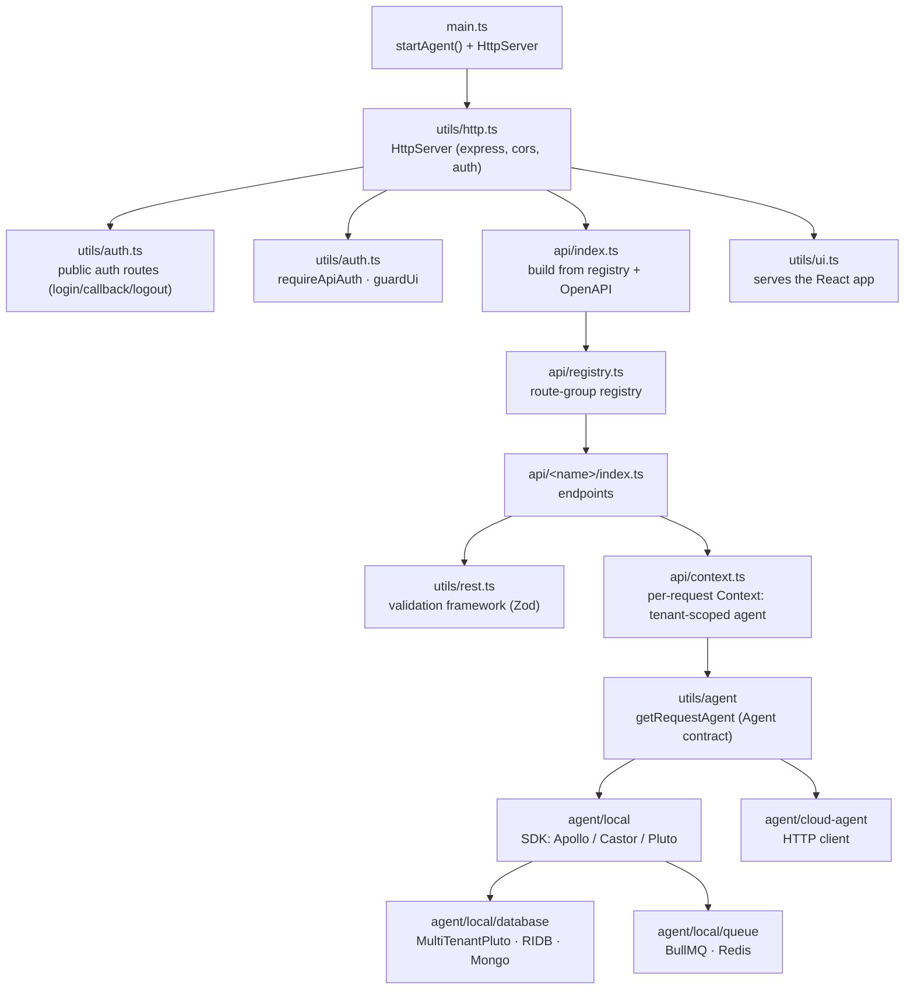
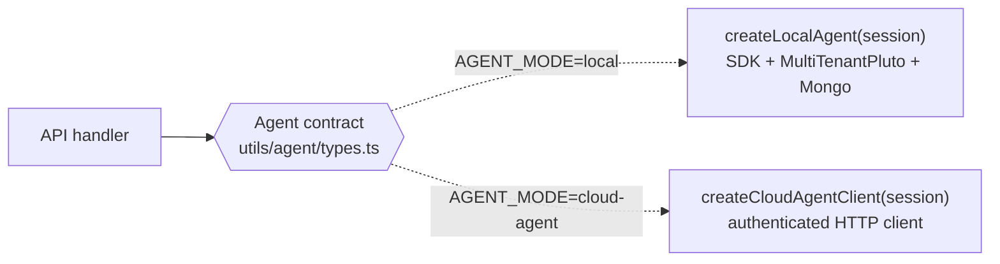

# Architecture

This document describes how the Identity Portal is structured and why. It is the
entry point for anyone working on the codebase. For setup and day-to-day commands
see [local-development.md](./local-development.md); the live API reference is the
Swagger UI at `/docs` while running in development.

## Overview

Identity Portal is a single application that exposes a REST API and serves a React
UI from the same Express process. It is a reference interface for Hyperledger
Identus and runs in one of two modes:

- **local (edge)** — identity operations run in-process through the Identus
  TypeScript SDK, with encrypted storage in MongoDB.
- **cloud** — identity operations are delegated to a separate Cloud Agent over an
  HTTP client; the portal holds no keys or storage of its own.

The mode is selected at startup by the `AGENT_MODE` environment variable. The rest
of the application is written against a single `Agent` contract and is unaware of
which mode is active.

Access is gated by an authentication layer: the Express server acts as a
Backend-for-Frontend (BFF) in front of Keycloak, and the app is multi-tenant — one
tenant is one authenticated user (their Keycloak subject). Every request runs as
that user, and in local mode their data is isolated from other tenants in the
shared store.

## System context



## Application architecture

Everything lives under `src`. The server boots in `main.ts`: it runs
`startAgent()` (in local mode this opens the store and starts the task-queue
worker), then builds an `HttpServer`. The HTTP layer wraps the routers in the auth
middleware and mounts two routers — the API (assembled from the route registry) and
the UI.



## Key design decisions

### Single application

Express and React are served from one process instead of separate services. This
keeps the reference implementation easy to run (`npm run dev`) and to reason about.
Vite is used in middleware mode in development; in production the built assets are
served statically (`utils/ui.ts`). See [ADR-0001](./adr/0001-single-application.md).

### Authentication gateway (BFF)

The Express server is the only party that talks to Keycloak (`utils/auth.ts`).
Two login flows are supported, both ending in a single encrypted, `httpOnly`
session cookie — tokens never reach the browser:

- **Native username/password** via the OAuth 2.0 Resource Owner Password
  Credentials grant (Keycloak "Direct Access Grant"). The branded React form posts
  to `POST /api/auth/login`; the server exchanges the credentials for tokens. This
  endpoint is rate-limited on top of Keycloak's brute-force protection.
- **Social / interactive** via the authorization code flow with PKCE
  (`/auth/login`, `/auth/google`, `/auth/github` → `/auth/callback`).

Two guards protect the app: `requireApiAuth` returns a JSON `401` for
unauthenticated `/api` calls (refreshing the access token when it is about to
expire), and `guardUi` `302`-redirects unauthenticated top-level page loads to
`/login`. The session `sub` (Keycloak subject) is the tenant identifier used
everywhere downstream.

### Agent abstraction

`local` and `cloud` are two implementations of the same contract,
`utils/agent/types.ts`. Callers depend only on the contract, so switching modes
does not touch the API or UI layers. `getRequestAgent(session)` returns the right
implementation for the current request. See
[ADR-0002](./adr/0002-agent-abstraction.md).



The contract covers `start`/`stop`, `dids.resolveDID`, and a `dids.prism` group for
DID management (`list`, `create`, `publish`, `deactivate`) — see
[Phase 2: DID management](#phase-2-did-management). Extending it is a deliberate
three-step change: update the contract, then both implementations, then the
endpoint that calls it. TypeScript enforces that neither mode is left behind.

### Multi-tenancy

The portal is multi-tenant: one tenant is one Keycloak subject. In local mode a
single Edge Agent process and one shared, encrypted store are partitioned per
tenant instead of running one agent per user. See
[ADR-0004](./adr/0004-multi-tenant-local-agent.md).

- **Tenant-scoped store.** `MultiTenantPluto` (`agent/local/database`) extends the
  SDK's `Pluto` and transparently stamps every write with the caller's `tenantId`
  and filters every read by it, so a tenant only ever sees its own DIDs, keys and
  DIDComm messages. The process opens the store once (`MultiTenantPluto.connect`)
  and constructs a per-tenant view (`new MultiTenantPluto(tenantId)`) per request.
- **Per-request binding.** `api/context.ts` resolves the agent for the current
  session (`getRequestAgent({ tenantId: session.sub, accessToken })`) and starts
  it before the handler runs, so a handler can never act outside its tenant.
- **Provisioning on first login.** `agent/local/provisioning.ts` runs once per new
  tenant: it registers the tenant, generates and stores its agent seed, creates a
  host peer DID with the mediator as its service endpoint
  (`agent/local/mediation.ts`), sends a DIDComm mediation request, and schedules
  its recurring message-fetch task. In cloud mode, `agent/cloud-agent/provisioning.ts`
  instead ensures the user owns a Cloud Agent wallet (probe → create → grant UMA
  permission). Both are best-effort: a provisioning failure is logged but never
  blocks login.
- **Per-tenant background work.** A BullMQ + Redis queue (`agent/local/queue`) runs
  recurring per-tenant jobs. The task wired today polls the mediator for new
  DIDComm messages (`fetch-messages`). Schedulers are keyed `<jobName>:<tenantId>`
  and upserted, so repeated logins never create duplicate jobs and one tenant's
  work never blocks another's.

### Route registry and OpenAPI

Route groups are declared in a single registry, `api/registry.ts`
(`routeGroups`, keyed by mount path). `api/index.ts` iterates the registry to
mount the routers, and the same registry drives two things with no code-generation
step: the OpenAPI 3.1 spec (`utils/openapi.ts`) and the fully-typed client the UI
uses (its type surface is inferred from the Zod route definitions at compile time).
See [ADR-0005](./adr/0005-route-registry.md).

In development the spec is served as Swagger UI at `/docs` and as raw JSON at
`/openapi.json`. Generation is skipped in production.

### Validation at the edge

`utils/rest.ts` wraps each route with Zod validation: input is parsed and checked
before the handler runs, and output is checked before it is sent. Schemas live in
`schemas/` and are the single source of truth for both validation and the OpenAPI
spec. Handlers throw `HttpError` for expected failures, which maps to the right
status code.

### Encrypted local storage

In local mode, storage is a `MultiTenantPluto` (`agent/local/database`) built on
RIDB with a MongoDB backend. The store is encrypted with `DB_ENCRYPTION_KEY`, so
the same key can restore the same data. Each tenant's agent seed is generated
during provisioning and persisted through the store's settings; it is supplied to
the agent from there, and a missing seed fails fast.

## Request lifecycle

An authenticated API request flows through the auth guard and the per-request
context before the handler runs.

```mermaid
sequenceDiagram
  participant B as Browser
  participant E as Express (http.ts)
  participant G as requireApiAuth (auth.ts)
  participant C as context.ts
  participant V as rest.ts (validation)
  participant H as Handler (api/&lt;name&gt;)
  participant A as Agent (local | cloud)

  B->>E: GET /api/dids/... (session cookie)
  E->>G: guard /api
  alt no valid session
    G-->>B: 401 Unauthorized
  else session valid (token refreshed if needed)
    G->>C: build per-request context
    C->>A: getRequestAgent({ tenantId: sub, accessToken }); agent.start()
    C->>V: invoke route with { agent }
    V->>V: validate input (Zod)
    V->>H: handler({ input, ctx })
    H->>A: ctx.agent.dids.resolveDID(did)
    A-->>H: DID Document
    H-->>V: result
    V->>V: validate output (Zod)
    V-->>B: 200 JSON
  end
```

## Components

| Path                              | Responsibility                                                                        |
| --------------------------------- | ------------------------------------------------------------------------------------- |
| `src/main.ts`                     | Entry point: `startAgent()` (store + queue), start `HttpServer`.                      |
| `src/utils/http.ts`               | `HttpServer`: Express app, auth middleware, API + UI routers.                         |
| `src/utils/auth.ts`               | Keycloak BFF: login (ROPC + OIDC/PKCE), session cookie, `requireApiAuth` / `guardUi`. |
| `src/api/index.ts`                | Builds the API router from the registry; serves Swagger / OpenAPI in dev.             |
| `src/api/registry.ts`             | Route-group registry (single source of truth) and typed `AppRouter`.                  |
| `src/api/context.ts`              | Per-request `Context`: resolves the tenant-scoped, authenticated agent.               |
| `src/api/<name>/index.ts`         | A route group (endpoints only), e.g. `api/dids`.                                      |
| `src/utils/rest.ts`               | Route builder with Zod input/output validation, `HttpError`.                          |
| `src/utils/openapi.ts`            | OpenAPI 3.1 generation from the route registry.                                       |
| `src/utils/ui.ts`                 | Serves the React app (Vite in dev, static in prod).                                   |
| `src/utils/agent/`                | `Agent` contract and `getRequestAgent` mode switch.                                   |
| `src/utils/agent/local/`          | Edge agent: SDK (Apollo/Castor/Pluto), provisioning, mediation, queue.                |
| `src/utils/agent/local/database/` | `MultiTenantPluto` over RIDB + MongoDB (tenant-scoped rows).                          |
| `src/utils/agent/local/queue/`    | BullMQ + Redis per-tenant recurring tasks.                                            |
| `src/utils/agent/cloud-agent/`    | Cloud Agent HTTP client and wallet auto-provisioning.                                 |
| `src/config/index.ts`             | Environment configuration.                                                            |
| `src/config/resolvers.ts`         | `PRISM_DID_RESOLVERS` (neoprism-backed) used by Castor.                               |
| `src/schemas/`                    | Zod schemas (request/response shapes).                                                |
| `src/ui/`                         | React frontend and its typed API client.                                              |

## Configuration

Configuration is read from the environment in `src/config/index.ts`, with the
DID resolvers in `src/config/resolvers.ts`. The variables fall into groups:

- **Core** — `PORT`, `AGENT_MODE`, `NODE_ENV`.
- **Local store** — `MONGODB_URI`, `DB_ENCRYPTION_KEY`.
- **DID resolution** — `NEOPRISM_BASE_URL`, `RESOLVER_URL`.
- **DIDComm / queue** — `MEDIATOR_DID`, `REDIS_URL`,
  `TENANT_MESSAGE_FETCH_INTERVAL_MS`.
- **Cloud Agent** — `CLOUD_AGENT_BASE_URL`, `CLOUD_AGENT_ADMIN_API_KEY`,
  `WALLET_AUTO_PROVISION_ENABLED`.
- **Auth (Keycloak / OIDC / session)** — `KEYCLOAK_ISSUER_URL`,
  `OIDC_CLIENT_ID`, `OIDC_CLIENT_SECRET`, `OIDC_REDIRECT_URI`, `SESSION_SECRET`,
  `SESSION_COOKIE_NAME`, `SESSION_TTL`, `AUTH_GOOGLE_ENABLED`,
  `AUTH_GITHUB_ENABLED`, `LOGIN_RATE_LIMIT_*`.

The defaults target the local Docker stack, so no `.env` file is required to run.
The full table with defaults is in
[local-development.md](./local-development.md#configuration).

## Phase 2: DID management

The `Agent` contract exposes a `dids.prism` group for the full `did:prism`
lifecycle:

| Method            | Purpose                                           |
| ----------------- | ------------------------------------------------- |
| `list()`          | List the tenant's Prism DIDs.                     |
| `create(keys)`    | Create a Prism DID with the requested key curves. |
| `publish(did)`    | Publish a DID to neoprism (returns a `txId`).     |
| `deactivate(did)` | Deactivate a published DID.                       |

DID resolution (`dids.resolveDID`) is implemented in local mode. The `dids.prism`
methods are scaffolded (they currently `throw "Not implemented"`) with inline notes
on how each maps to the SDK (`agent.createDID` / `agent.publishDID`) or the Cloud
Agent registrar; they are the work items of Phase 2 and must be implemented for
both modes.

## Runtime environments

Two Docker Compose files provide the supporting services:

- `docker.local.compose.yml` — `mongo-identus` (:27019), `neoprism` (:8081),
  `mediator` (:8080) with its Mongo, `redis` (:6379), `keycloak` (:9980) with its
  init jobs, and `mongo-express` (:8888). Brought up with `npm run local:up`.
- `docker.cloud.compose.yml` — `postgres` (:5432), `neoprism` (:8081), the
  `cloud-agent` (:8085 HTTP, :8090 DIDComm), `mediator` with its Mongo, and
  `keycloak`. Brought up with `npm run cloud-agent:up`.

## Extending the API

Two common changes:

1. **New endpoint** — add `src/api/<name>/index.ts` exporting a route-group factory
   (built with `createRestRouter`) as its default export, then add one entry to `routeGroups` in
   `api/registry.ts`. The runtime router, OpenAPI spec, and typed client all pick
   it up from there.
2. **New agent capability** — add the method to `utils/agent/types.ts`, implement
   it in `agent/local` and `agent/cloud-agent`, then call it from the endpoint.

## References

- Live API reference: `/docs` (development).
- Setup and commands: [local-development.md](./local-development.md).
- Design decisions: [ADR index](./adr/README.md).
- Identus SDK building blocks: Apollo (crypto), Castor (DID operations), Pluto
  (storage).
